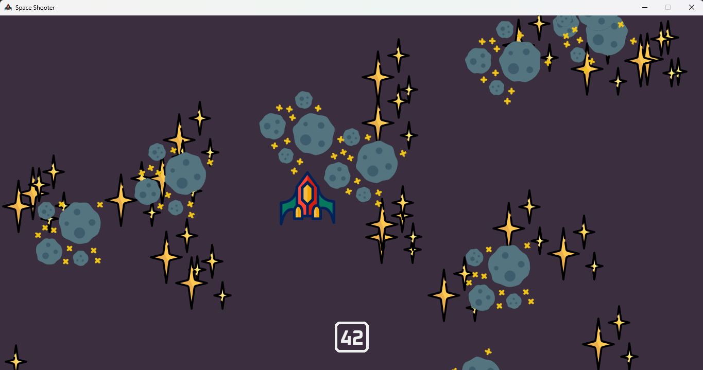
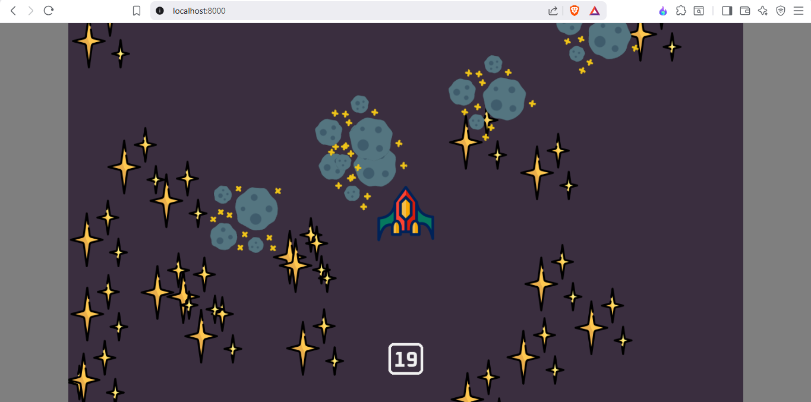

<h1 align="center">🚀 Clash in Space</h1>

<p align="center">
A fast-paced arcade space shooter built with <b>Pygame-CE</b>.
<br>
Destroy meteors, survive as long as possible, and play in your browser or on desktop.
</p>


[](https://shivamkr12.github.io/Clash-in-Space)
[](https://github.com/ShivamKR12/Clash-in-Space/actions/workflows/build.yml)
[](https://github.com/ShivamKR12/Clash-in-Space/actions/workflows/pygbag.yml)
[](https://shivamkr12.github.io/Clash-in-Space)


The game is available in **two versions**:

* 🖥 **Desktop version (Windows executable)**
* 🌐 **Web version (runs in the browser using pygbag + WebAssembly)**

---

## 🎮 Play the Game

### 🌐 Web Version

Play instantly in your browser:

**[https://shivamkr12.github.io/Clash-in-Space](https://shivamkr12.github.io/Clash-in-Space)**

No installation required.

---

### 🖥 Desktop Version

Download the latest Windows executable from the **Releases** page.

Or download directly:

[Download ZIP](https://github.com/ShivamKR12/Clash-in-Space/releases)

Extract and run:

```
clash-in-space.exe
```

---

# 📸 Screenshot

**On Desktop**


**On The Web**


---

# ✨ Features

* 🚀 **Arcade Gameplay**
  Control a spaceship and survive waves of falling meteors.

* ☄ **Meteor Destruction**
  Shoot lasers to destroy incoming asteroids.

* 💥 **Animated Explosions**
  Smooth sprite-based explosion animations.

* 🔊 **Sound Effects & Music**
  Laser sounds, explosion effects, and background music.

* 🧮 **Score System**
  Your score increases the longer you survive.

* 🌐 **Web Build**
  Play directly in the browser using **pygbag**.

* 🖥 **Desktop Build**
  Windows executable built with **PyInstaller**.

---

# 🎮 Controls

| Key     | Action               |
| ------- | -------------------- |
| ⬅ ➡ ⬆ ⬇ | Move spaceship       |
| W A S D | Alternative movement |
| Space   | Shoot laser          |

---

# 📦 Installation (Run from Source)

Clone the repository:

```bash
git clone https://github.com/ShivamKR12/Clash-in-Space.git
cd Clash-in-Space
```

Install dependencies:

```bash
pip install pygame-ce
```

Run the **desktop version**:

```bash
python game.py
```

---

# 🌐 Run the Web Version Locally

Install **pygbag**:

```bash
pip install pygbag
```

Run:

```bash
pygbag main.py
```

The game will open in your browser automatically.

---

# 🏗 Project Structure

```
Clash-in-Space
│
├── game.py          # Desktop version
├── main.py          # Web version (pygbag)
├── game.spec        # PyInstaller build configuration
│
├── assets
│   ├── explosion/
│   ├── player.png
│   ├── meteor.png
│   ├── laser.png
│   ├── star.png
│   ├── Oxanium-Bold.ttf
│   └── sounds
│
├── .github/workflows
│   ├── build.yml        # Windows build automation
│   └── pygbag.yml       # Web build automation
│
└── README.md
```

---

# ⚙️ Automated Builds

This repository uses **GitHub Actions** to automatically build both versions.

## 🖥 Windows Executable

Workflow: `.github/workflows/build.yml`

Build process:

1. Install Python 3.11
2. Install dependencies
3. Run **PyInstaller**
4. Package executable
5. Publish to **GitHub Releases**

Generated file:

```
dist/clash-in-space.zip
```

---

## 🌐 Web Version

Workflow: `.github/workflows/pygbag.yml`

Build process:

1. Install **pygbag**
2. Compile `main.py` to WebAssembly
3. Deploy to **GitHub Pages**

Output folder:

```
build/web
```

Hosted automatically at:

```
https://shivamkr12.github.io/Clash-in-Space
```

---

# 🛠 Build the Executable Manually

You can build the Windows version locally using **PyInstaller**.

Install:

```bash
pip install pyinstaller pygame-ce
```

Build:

```bash
pyinstaller --onefile --windowed --icon=assets/icon.ico --add-data "assets;assets" game.py
```

Or use the provided spec file:

```bash
pyinstaller game.spec
```

---

# 🤝 Contributing

Contributions are welcome!

Steps:

1. Fork the repository
2. Create a new branch

```
git checkout -b feature-name
```

3. Commit your changes

```
git commit -m "Added feature"
```

4. Push to GitHub

```
git push origin feature-name
```

5. Open a **Pull Request**

---

# 📜 License

This project is licensed under the **MIT License**.

See the [LICENSE](LICENSE) file for details.

---

# 👨‍💻 Author

**Shivam Kumar**

GitHub:
[https://github.com/ShivamKR12](https://github.com/ShivamKR12)
